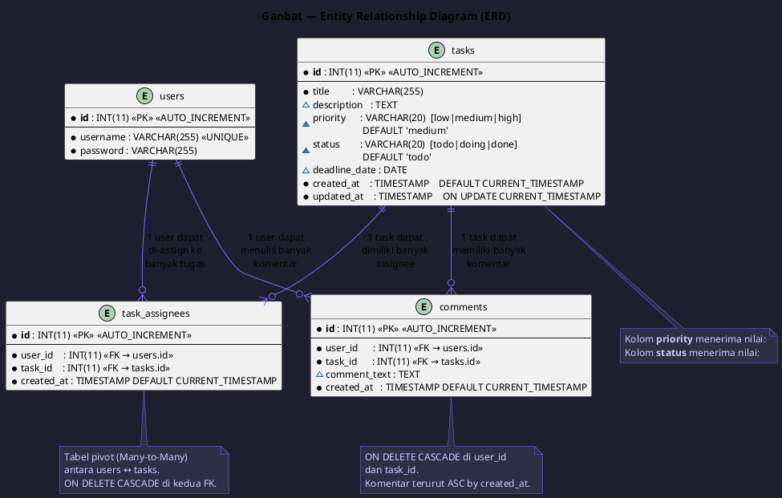

# 📋 Ganbat — Task Management System (Sistem Manajemen Tugas)

**Ganbat** adalah platform manajemen tugas visual berbasis web yang mengadopsi konsep *Kanban board*. Aplikasi ini dirancang untuk memfasilitasi pelacakan kemajuan tugas secara terpusat, transparan, dan terstruktur guna meningkatkan produktivitas serta efisiensi kolaborasi tim. Melalui Ganbat, pengguna dapat membuat, mendelegasikan, dan memantau pergerakan status pekerjaan dari awal hingga selesai serta menetapkan batas waktu penyelesaian yang jelas.

Proyek ini dibangun menggunakan pendekatan *Separation of Concerns* (SoC) berbasis PHP murni (*native*) tanpa *framework* untuk menjamin keterbacaan kode, kemudahan kolaborasi multi-anggota tanpa *conflict*, serta keamanan aplikasi yang optimal.

---

## ⚙️ Tech Stack

| Layer        | Technology                          |
|--------------|-------------------------------------|
| **Back-end** | Native PHP (Tanpa Framework), PDO  |
| **Front-end**| Tailwind CSS (via CDN)             |
| **Database** | MySQL                               |
| **Scripting**| Vanilla JS (JavaScript Murni)      |
| **Server** | Apache (Laragon / XAMPP)            |

---

## ✨ Fitur Utama & Kriteria Sistem

### 1. Fitur Fungsional Inti (Core Features)
* **Sistem Autentikasi (Login / Register)**: Modul autentikasi bagi anggota tim untuk membuat akun baru dan mengakses ruang kerja (*workspace*). Dilengkapi pengamanan halaman utama menggunakan manajemen *session* PHP murni untuk memproteksi *dashboard* dari akses tanpa izin.
* **Pembuatan Tugas (Create Task)**: Antarmuka berupa formulir interaktif untuk menambahkan kartu tugas baru yang menampung komponen judul, deskripsi, dan tingkat prioritas.
* **Papan Kanban (Task Status Mapping)**: Fungsionalitas untuk mengubah dan melacak pergerakan status tugas melalui tiga tahap utama: *Todo* (Akan dikerjakan), *Doing* (Sedang dikerjakan), dan *Done* (Selesai).
* **Pendelegasian Tugas (Assign Member)**: Fitur pendelegasian tugas yang menautkan satu atau lebih akun pengguna teregistrasi ke dalam kartu tugas tertentu (*assignee*).
* **Manajemen Tenggat Waktu (Deadline)**: Modul penetapan tanggal batas waktu penyelesaian untuk setiap kartu tugas yang dibuat.

### 2. Fitur Tambahan (Optional Value-Added Features)
* **Hitung Mundur Real-time (Realtime Countdown)**: Indikator visual berupa hitung mundur presisi (hari, jam, menit) menuju batas waktu *deadline* pada setiap kartu tugas menggunakan JavaScript murni.
* **Komentar Tugas (Task Comments)**: Fungsionalitas diskusi atau log aktivitas di dalam detail kartu tugas untuk memfasilitasi komunikasi antar-anggota tim.

### 3. Antarmuka & Pengalaman Pengguna (UI/UX)
* **Board Layout**: Antarmuka utama mengimplementasikan tata letak berbasis kolom yang merepresentasikan status *Todo*, *Doing*, dan *Done*, di mana kartu tugas (*task cards*) dirender secara dinamis di dalam kolom yang sesuai.
* **Visual Hierarchy**: Elemen tenggat waktu dibuat menonjol. Sistem akan memberikan indikator warna otomatis (seperti teks menjadi merah) apabila batas waktu pengerjaan sudah lewat (*overdue*).
* **Responsive Design**: Struktur kolom yang fleksibel dan adaptif, otomatis bertransformasi menjadi susunan vertikal (*stack*) apabila diakses melalui layar perangkat seluler untuk menjaga keterbacaan data.

### 4. Aspek Keamanan Dasar (Security)
* **SQL Injection Prevention**: Seluruh operasi pemrosesan basis data wajib menggunakan mekanisme *PDO Prepared Statements*.
* **XSS Prevention**: Input dari pengguna disanitasi secara ketat sebelum dirender ke layar guna menghindari celah keamanan *Cross-Site Scripting*.

---

## 📁 Struktur Direktori Resmi (Directory Structure)

ganbat/
├── database/                   # Skrip basis data
│   ├── 05_ERD.puml             # File source PlantUML untuk Entity Relationship Diagram (ERD)
│   └── schema.sql              # Struktur tabel ekspor MySQL (users, tasks, dll.)
├── public/                     # Web-accessible root (Diakses langsung oleh browser)
│   ├── css/                    # Custom stylesheets tambahan
│   ├── js/                     # Client-side JavaScript
│   │   ├── main.js             # Script interaktif global
│   │   └── countdown.js        # Logika hitung mundur real-time (Vanilla JS)
│   ├── assets/                 # Berkas media pendukung (gambar, ikon, logo)
│   ├── index.php               # Dashboard utama (Aplikasi Kanban Board)
│   ├── login.php               # Antarmuka Formulir Login
│   └── register.php            # Antarmuka Formulir Registrasi
├── src/                        # Protected application code (Terproteksi internal)
│   ├── config/                 # Konfigurasi koneksi database global
│   │   └── database.php        # Instansiasi koneksi PDO basis data
│   ├── controllers/            # Logika penanganan request & pemrosesan data (Backend)
│   │   ├── AuthController.php  # Handler registrasi, login, dan autentikasi session
│   │   ├── TaskController.php  # Handler CRUD tugas, update status, dan assignment
│   │   └── CommentController.php # Handler pengelolaan komentar diskusi tugas
│   ├── views/                  # Komponen presentasi antarmuka (UI Components)
│   │   ├── layouts/            # Kerangka dasar struktur halaman web
│   │   │   ├── header.php      # Tag pembuka HTML, meta tag, dan CDN Tailwind
│   │   │   └── footer.php      # Tag penutup HTML dan pemanggilan skrip JS
│   │   └── components/         # Potongan UI modular yang dapat digunakan kembali
│   │       ├── navbar.php      # Komponen navigasi atas
│   │       ├── board_column.php# Struktur kolom status Kanban board
│   │       ├── task_card.php   # Desain kartu tugas dinamis
│   │       └── comment_section.php # Komponen visual area komentar diskusi
│   └── utils/                  # Fungsi bantuan utilitas
│       └── helpers.php         # Fungsi format tanggal, validasi waktu, sanitasi input
├── .gitignore                  # Daftar file penyaring tracking Git
└── README.md                   # Dokumentasi utama proyek

---

## 📊 Entity Relationship Diagram (ERD)

Aplikasi **Ganbat** menggunakan skema basis data relasional berikut untuk mengelola data pengguna, tugas, pendelegasian, dan komentar. 

Berikut adalah visualisasi diagram hubungan entitas (ERD) dalam format PlantUML:

- **File Source PlantUML:** [database/05_ERD.puml](file:///d:/KULIAH/Semester4/PDW/PDWA-Ganbat-main/database/05_ERD.puml)



### Penjelasan Hubungan & Desain Database:
- **Tabel `users`**: Berisi kredensial pengguna terdaftar (`username` bersifat unik).
- **Tabel `tasks`**: Berisi detail setiap tugas termasuk tenggat waktu (`deadline_date`), prioritas (`low`, `medium`, `high`), dan status (`todo`, `doing`, `done`).
- **Tabel `task_assignees`**: Pivot table yang memfasilitasi hubungan *Many-to-Many* antara `users` dan `tasks`, dengan relasi foreign key `ON DELETE CASCADE` untuk menjaga integritas data jika tugas atau pengguna dihapus.
- **Tabel `comments`**: Menyimpan pesan diskusi untuk setiap tugas, terkait langsung dengan pengguna yang menulisnya.

---

## 📋 Prasyarat Sistem (Prerequisites)

Sebelum menjalankan aplikasi **Ganbat** secara lokal, pastikan perangkat Anda telah memenuhi spesifikasi berikut:
* **PHP** >= 8.1
* **MySQL** >= 8.0
* **Apache Web Server** (Sudah termasuk di dalam paket Laragon / XAMPP)
* **Ekstensi PHP Aktif**: `pdo_mysql` untuk konektivitas basis data relasional.

---

## 🚀 Panduan Instalasi Lokal (Local Development Guide)

### Langkah 1: Kloning Repositori Proyek
Letakkan proyek ini pada direktori server lokal Anda (*document root*):
```bash
# Pengguna Laragon
cd C:\laragon\www

# Pengguna XAMPP
cd C:\xampp\htdocs

# Jalankan perintah kloning
git clone https://github.com/spicyshibe/PDWA-Ganbat.git ganbat
cd ganbat

Langkah 2: Impor Basis Data (Database Setup)
Buka aplikasi manajemen basis data Anda (seperti phpMyAdmin melalui tautan http://localhost/phpmyadmin).

Buat sebuah basis data baru dengan nama ganbat_db.

Pilih menu Import, cari berkas skema yang berada di folder proyek: database/schema.sql, kemudian klik Go / Kirim.

Langkah 3: Konfigurasi Kredensial Basis Data
Sesuaikan pengaturan kredensial MySQL lokal Anda di dalam berkas src/config/database.php:

private static string $host     = 'localhost';
private static string $dbName   = 'ganbat_db';
private static string $username = 'root';
private static string $password = ''; // 

Isikan password jika MySQL lokal Anda memilikinya

Langkah 4: Menjalankan Aplikasi
Opsi A (Menggunakan Laragon/XAMPP): Aktifkan layanan Apache dan MySQL melalui control panel, lalu akses aplikasi menggunakan peramban melalui alamat: http://localhost/ganbat/public/index.php.

Opsi B (Menggunakan PHP Built-in Server): Jalankan perintah berikut pada terminal di dalam folder utama proyek:

php -S localhost:8000 -t public

Kemudian buka browser Anda dan akses alamat http://localhost:8000